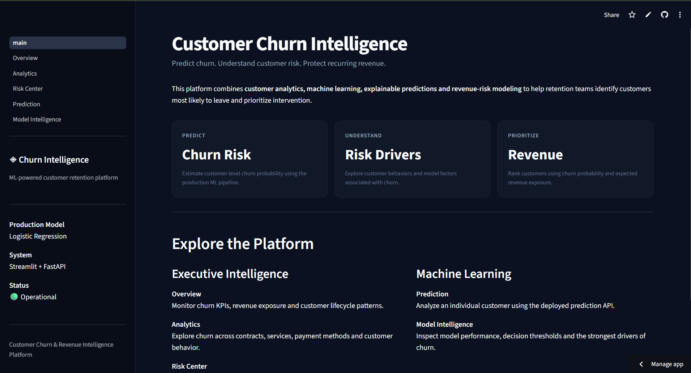
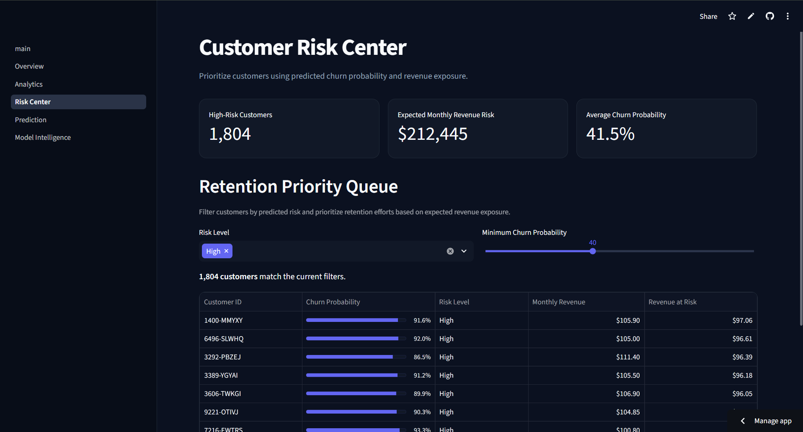
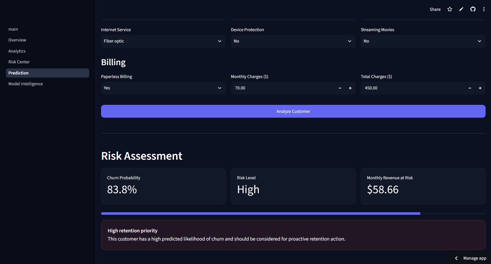
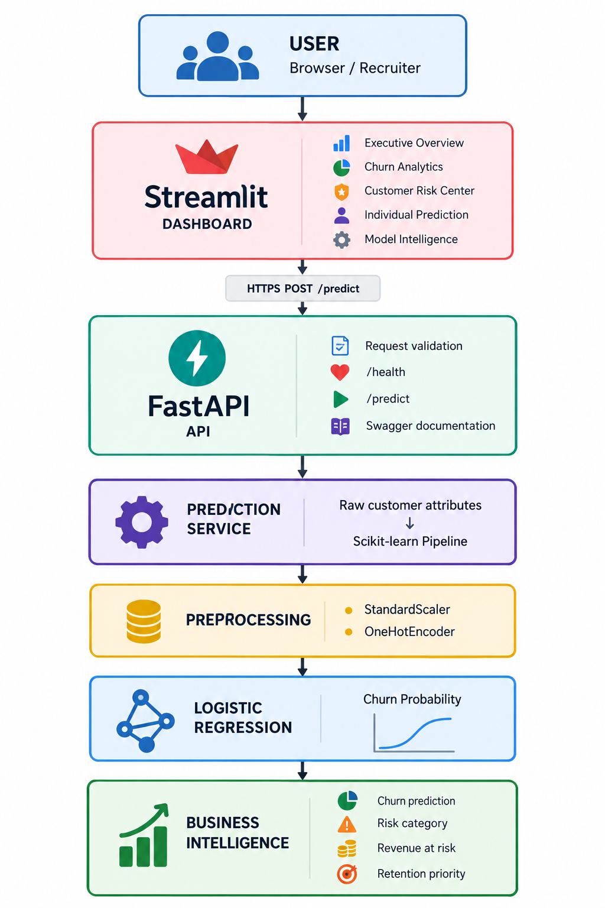
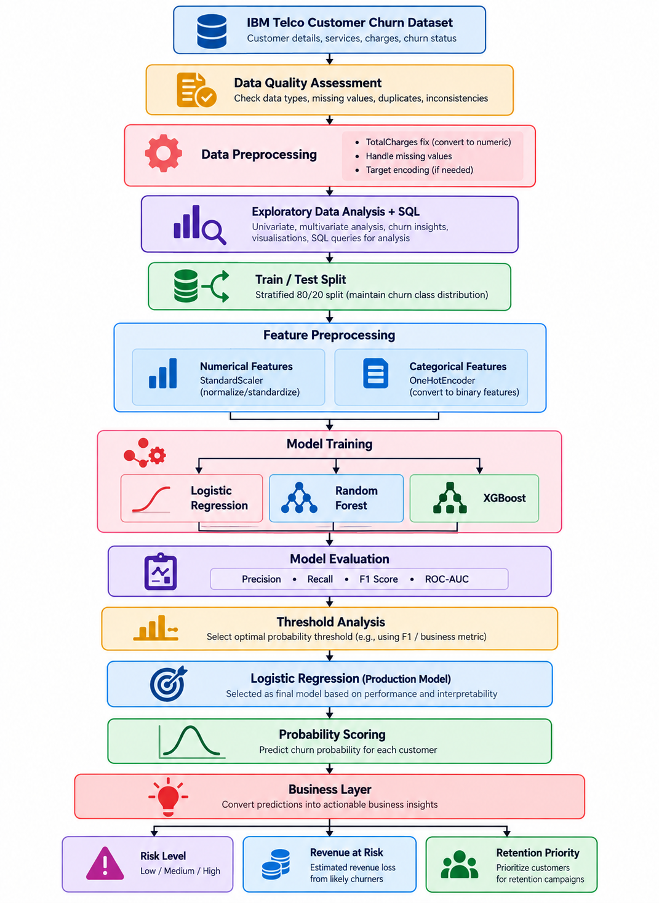

<div align="center">

# Customer Churn & Revenue Intelligence Platform

### An end-to-end machine learning system for predicting customer churn, quantifying revenue risk, and prioritizing retention efforts.

[](https://www.python.org/)
[](https://scikit-learn.org/)
[](https://fastapi.tiangolo.com/)
[](https://streamlit.io/)
[](https://pytest.org/)

**[Live Dashboard](https://customer-churn-intelligence-ggvqflveicovqd3huorsjo.streamlit.app/)** · **[API Documentation](https://customer-churn-intelligence-ffmx.onrender.com/docs)**

</div>

---

<p align="center">
  
</p>

## Overview

Customer churn prediction is only useful when the result can drive an action.

This project builds an end-to-end churn intelligence system around the **IBM Telco Customer Churn dataset**. It combines exploratory analysis, SQL, machine learning, model interpretation, API-based inference, and an interactive dashboard to answer three practical questions:

- **Which customers are most likely to churn?**
- **How much monthly revenue is exposed?**
- **Which customers should retention teams prioritize first?**

The final system scores churn probability, assigns customer risk levels, estimates expected revenue at risk, and exposes predictions through a deployed FastAPI service.

---

## Model Performance

Three classification models were evaluated: **Logistic Regression, Random Forest, and XGBoost**.

Logistic Regression was selected as the production model based on its predictive performance and interpretability for retention analysis.

| Metric | Score |
|---|---:|
| Precision | **0.6485** |
| Recall | **0.5722** |
| F1 Score | **0.6080** |
| ROC-AUC | **0.8359** |
| Decision Threshold | **0.40** |

The classification threshold was evaluated separately instead of relying only on the default `0.50`, allowing the system to better reflect the trade-off between identifying churners and generating false positives.

---

## Product

### Customer Risk Center

Customers are ranked using predicted churn probability and expected monthly revenue exposure, creating a practical retention priority queue.

<p align="center">
  
</p>

### Individual Churn Prediction

Customer attributes are sent to the deployed FastAPI service, which returns the churn probability, prediction, risk level, and expected monthly revenue at risk.

<p align="center">
  
</p>

---

## System Architecture

<p align="center">
  
</p>

The application separates analytics from real-time model inference.

**Streamlit** provides the user interface and historical analytics, while prediction requests are sent over HTTP to a deployed **FastAPI** service. The API validates incoming customer data and passes it through the saved Scikit-learn preprocessing and Logistic Regression pipeline.

This keeps model inference behind a reusable API rather than coupling prediction logic directly to the dashboard.

---

## Machine Learning Workflow

<p align="center">
  
</p>

The modeling workflow uses **7,032 cleaned customer records** with a stratified **80/20 train-test split**.

Numerical features are standardized using `StandardScaler`, while categorical variables are transformed using `OneHotEncoder`. Both transformations are packaged with the classifier inside a Scikit-learn `Pipeline`, ensuring the same preprocessing is used during training and production inference.

Model evaluation focuses on **Precision, Recall, F1 Score, and ROC-AUC** rather than accuracy alone.

---

## Revenue-Aware Risk Scoring

Prediction probability is translated into a simple business metric:

```text
Expected Monthly Revenue at Risk
= Churn Probability × Monthly Charges
```

For example, a customer with an `85%` churn probability and `$100` in monthly charges represents:

```text
0.85 × $100 = $85 expected monthly revenue at risk
```

This allows retention efforts to consider both **likelihood of churn** and **financial impact**.

---

## API

The production model is exposed through a REST API built with FastAPI.

| Method | Endpoint | Purpose |
|---|---|---|
| `GET` | `/` | Service information |
| `GET` | `/health` | API health check |
| `POST` | `/predict` | Generate churn prediction |
| `GET` | `/docs` | Swagger API documentation |

### Example Request

```json
{
  "gender": "Female",
  "SeniorCitizen": 0,
  "Partner": "Yes",
  "Dependents": "No",
  "tenure": 5,
  "PhoneService": "Yes",
  "MultipleLines": "No",
  "InternetService": "Fiber optic",
  "OnlineSecurity": "No",
  "OnlineBackup": "No",
  "DeviceProtection": "No",
  "TechSupport": "No",
  "StreamingTV": "Yes",
  "StreamingMovies": "Yes",
  "Contract": "Month-to-month",
  "PaperlessBilling": "Yes",
  "PaymentMethod": "Electronic check",
  "MonthlyCharges": 95.5,
  "TotalCharges": 477.5
}
```

Interactive API documentation is available at:

**[customer-churn-intelligence-ffmx.onrender.com/docs](https://customer-churn-intelligence-ffmx.onrender.com/docs)**

---

## Tech Stack

| Layer | Technologies |
|---|---|
| Data Analysis | Python, Pandas, NumPy |
| Business Analysis | SQL |
| Machine Learning | Scikit-learn, XGBoost |
| Preprocessing | StandardScaler, OneHotEncoder |
| Visualization | Plotly |
| Dashboard | Streamlit |
| API | FastAPI, Pydantic, Uvicorn |
| Testing | Pytest, HTTPX |
| Deployment | Render, Streamlit Community Cloud |
| Version Control | Git, GitHub |

---

## Repository Structure

```text
customer-churn-intelligence/
│
├── api/                     # FastAPI inference service
├── app/                     # Streamlit application
│   ├── components/
│   ├── pages/
│   └── services/
│
├── assets/                  # Dashboard screenshots
├── data/
│   ├── raw/
│   └── processed/
│
├── docs/                    # Architecture and ML workflow diagrams
├── models/                  # Trained production pipeline
├── notebooks/               # Data analysis and modeling experiments
├── sql/                     # SQL business analysis
│
├── src/
│   ├── data/                # Preprocessing utilities
│   └── models/              # Training, prediction and explanation
│
├── tests/                   # Automated API and prediction tests
├── .streamlit/
├── requirements.txt
└── README.md
```

---

## Run Locally

Clone the repository:

```bash
git clone https://github.com/Abhishek131005/customer-churn-intelligence.git
cd customer-churn-intelligence
```

Create and activate a virtual environment:

```bash
python -m venv .venv
```

Windows:

```powershell
.venv\Scripts\Activate.ps1
```

Install dependencies:

```bash
pip install -r requirements.txt
```

Start the prediction API:

```bash
uvicorn api.main:app --reload
```

In another terminal, start the dashboard:

```powershell
$env:PYTHONPATH = (Get-Location).Path
streamlit run app/main.py
```

Run the automated tests:

```bash
pytest -v
```

---

## Key Business Findings

Analysis of the Telco dataset highlighted several useful churn patterns:

- **Month-to-month contracts** show substantially greater churn vulnerability than longer-term contracts.
- Churn risk is concentrated more heavily among customers in the **earlier stages of their lifecycle**.
- Service and support characteristics contribute meaningful signals to churn behavior.
- Churn probability alone does not determine business priority. Combining probability with customer revenue produces a more useful retention ranking.

---

## Future Improvements

The current system provides a complete batch analytics and real-time inference workflow. Natural next steps include:

- model and data drift monitoring
- experiment tracking and model versioning
- scheduled model retraining
- persistent prediction logging
- retention campaign outcome tracking
- probability calibration and threshold optimization using explicit intervention costs

---

<div align="center">

### Customer Churn & Revenue Intelligence Platform

**Machine Learning · Analytics · API · Business Intelligence**

[Live Dashboard](https://customer-churn-intelligence-ggvqflveicovqd3huorsjo.streamlit.app/) · [API Docs](https://customer-churn-intelligence-ffmx.onrender.com/docs)

</div>
